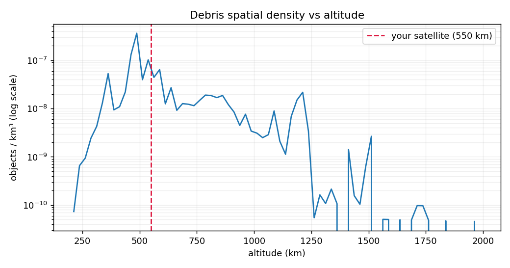
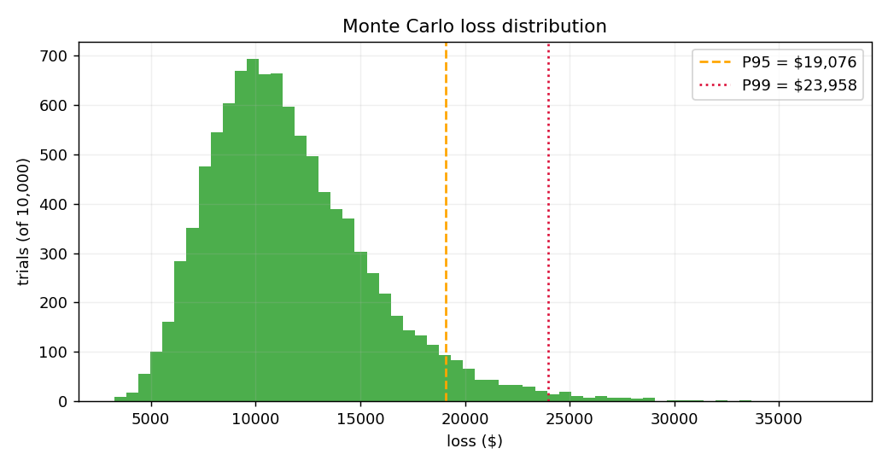
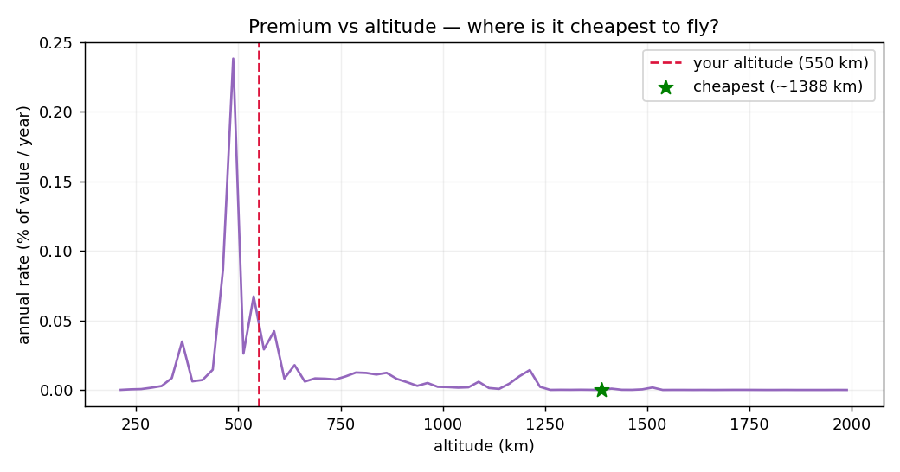

# Underwrite a Satellite 🛰️

**An insurance pricing engine for spacecraft.** Feed it a satellite's orbit,
size, value, and mission length — it returns a quoted insurance premium based on
real orbital-debris collision risk, computed from the live NASA / CelesTrak
catalog.

Built for the **NASA × Hack Club Stardance Challenge**.

<!-- TODO: replace with your deployed Streamlit URL after Phase 5 deploy -->
**▶️ Live demo:** _coming soon (Streamlit Community Cloud)_

---

## The pitch

Space is getting crowded, and debris is the fastest-growing risk to anything in
orbit. But how do you put a *price* on that risk? This project does it the way an
actuary would: it pulls the real catalog of ~18,000 tracked objects, measures how
densely packed each altitude is, models the chance your satellite gets hit, and
turns that into an insurance premium — with a proper risk load and a tail-risk
(VaR) readout, not just a point estimate.

The best part: a **premium-vs-altitude curve** that shows *where it's cheapest to
fly your satellite*. Debris-empty altitudes are far cheaper to insure than the
crowded Starlink (~550 km) and collision-debris (~800 km) shells.

## How it works

```
CelesTrak catalog ─► spatial density ─► debris flux ─► collision probability
                                                              │
                          premium ◄── pricing ◄── Monte Carlo ┘
```

1. **Ingest** — fetch the `active` catalog + 4 major debris clouds, cache 24h,
   compute each object's mean altitude from its mean motion (Kepler's 3rd law).
2. **Density** — bin objects into 25 km shells, divide by shell volume → objects/km³.
3. **Flux + collision** — `F = density · v_rel · LNT`, then a Poisson model
   `P = 1 − exp(−F·A·T)`.
4. **Monte Carlo** — 10,000 trials sampling debris density, impact velocity, and
   area uncertainty → a full loss distribution.
5. **Pricing** — expected loss + risk load (std-dev principle) + 15% expense →
   premium and annual rate.

Full math, assumptions, data sources, and limitations are in
[METHODOLOGY.md](METHODOLOGY.md).

## What it looks like

**Debris density vs altitude** — the catalog's real structure: the Starlink
shell at ~550 km, sun-sync + 2009 Iridium/Cosmos collision debris at ~800 km, and
an upper band near ~1500 km.



**Monte Carlo loss distribution** — 10,000 trials, with P95/P99 Value-at-Risk
lines.



**Premium vs altitude** — where is it cheapest to fly? (the ⭐ marks the
cheapest shell)



## Quick start

```bash
python -m venv .venv
source .venv/bin/activate
pip install -r requirements.txt

pytest                                  # run the 49-test suite
streamlit run src/app/streamlit_app.py  # launch the quote app
```

The first run fetches the catalog from CelesTrak (~2–3 s) and caches it to
`data/cache/` for 24 hours; subsequent runs are instant.

## Project layout

```
src/ingest/catalog.py     fetch + cache CelesTrak data, compute altitudes
src/model/density.py      shell volumes + spatial density
src/model/collision.py    debris flux + Poisson collision probability
src/model/montecarlo.py   10k-trial uncertainty simulation
src/model/pricing.py      premium calculation + end-to-end generate_quote()
src/app/streamlit_app.py  the quote UI (3 charts)
tests/                    49 tests (run with pytest)
scripts/make_figures.py   regenerate the images above (needs requirements-dev.txt)
```

## Sample quote

A 2 m², 5-year, $10M satellite at 550 km (catalog snapshot 2026-06-09):

| | |
|---|---|
| Mean collision probability | 1.17 × 10⁻³ |
| Expected loss | $11,683 |
| Risk load (0.25·σ) | $987 |
| Expense load (15%) | $1,900 |
| **Premium** | **$14,570** |
| **Annual rate** | **0.029%** of value / year |

(That rate is below the real-market 0.5–2%/yr because this model prices debris
collision *only* — see METHODOLOGY.md §5.)

## Data sources & credits

- **[CelesTrak](https://celestrak.org/)** — GP orbital element catalog (active
  satellites + debris clouds).
- **[NASA Orbital Debris Program Office](https://orbitaldebris.jsc.nasa.gov/)** —
  lethal non-trackable debris population estimates.

Built with Python, pandas, NumPy, Streamlit, and Plotly.
